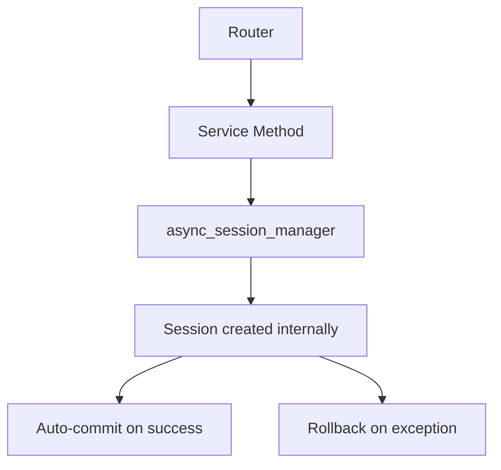

# Database Session Refactoring Plan

## Goal
Remove `Depends(get_db)` pattern from routers. Session management should happen only inside service methods using the existing `async_session_manager`.

## Current Issues
1. `config/__init__.py` exports `get_db` but it doesn't exist in `database.py`
2. Routers use `Depends(get_db)` to inject sessions - couples routing to session lifecycle
3. Services receive session as parameter but don't own session lifecycle
4. Manual commit/rollback handling in services

## Architecture: Service-Based Session Management



**Key point**: Use the existing `async_session_manager` from `database.py` - no need for separate read/write session managers.

## Service Pattern

Each service method:
1. Creates session via `async_session_manager`
2. Performs database operations
3. Commits automatically (handled by manager)
4. Rolls back on exception (handled by manager)

```python
@staticmethod
async def get_guest(guest_id: str) -> Optional[Guest]:
    """Get a guest by ID. Session managed internally."""
    async with async_session_manager() as session:
        result = await session.execute(
            select(Guest).where(Guest.id == guest_id)
        )
        return result.scalar_one_or_none()

@staticmethod
async def create_guest(...) -> Guest:
    """Create a guest. Auto-commits on success."""
    async with async_session_manager() as session:
        guest = Guest(...)
        session.add(guest)
        await session.refresh(guest)
        return guest
```

## Proposed Changes

### Step 1: Fix `config/__init__.py`
Remove incorrect `get_db` export.

### Step 2: Refactor `GuestService` → Split into `GuestReadService` and `GuestWriteService`

**Note**: Use the existing `async_session_manager` - no changes to database.py needed.

```python
# guests/service.py

class GuestReadService:
    """Read-only operations for guests."""

    @staticmethod
    async def get_guest(guest_id: str) -> Optional[Guest]:
        async with async_session_manager() as session:
            result = await session.execute(
                select(Guest).where(Guest.id == guest_id)
            )
            return result.scalar_one_or_none()

    @staticmethod
    async def get_guests(event_id: str | None = None, status: GuestStatus | None = None, skip: int = 0, limit: int = 100) -> tuple[List[Guest], int]:
        async with async_session_manager() as session:
            # ... query logic

    @staticmethod
    async def get_guest_by_token(token: str) -> Optional[Guest]:
        async with async_session_manager() as session:
            result = await session.execute(
                select(Guest).where(Guest.rsvp_token == token)
            )
            return result.scalar_one_or_none()


class GuestWriteService:
    """Write operations for guests."""

    @staticmethod
    async def create_guest(...) -> Guest:
        async with async_session_manager() as session:
            guest = Guest(...)
            session.add(guest)
            await session.refresh(guest)
            return guest

    @staticmethod
    async def update_guest(guest_id: str, ...) -> Guest:
        async with async_session_manager() as session:
            # Get guest first
            result = await session.execute(
                select(Guest).where(Guest.id == guest_id)
            )
            guest = result.scalar_one_or_none()
            if not guest:
                raise ValueError("Guest not found")
            # Update fields
            # Auto-commit happens here
            await session.refresh(guest)
            return guest

    @staticmethod
    async def delete_guest(guest_id: str) -> None:
        async with async_session_manager() as session:
            result = await session.execute(
                select(Guest).where(Guest.id == guest_id)
            )
            guest = result.scalar_one_or_none()
            if guest:
                await session.delete(guest)
            # Auto-commit happens here

    @staticmethod
    async def send_invitation(guest_id: str, event_id: str) -> None:
        """Send invitation email. Creates own session."""
        async with async_session_manager() as session:
            # Get guest and event
            guest_result = await session.execute(
                select(Guest).where(Guest.id == guest_id)
            )
            guest = guest_result.scalar_one_or_none()

            event_result = await session.execute(
                select(Event).where(Event.id == event_id)
            )
            event = event_result.scalar_one_or_none()

            if guest and event:
                # Send email (outside session)
                await email_service.send_invitation(...)

    @staticmethod
    async def update_rsvp_response(...) -> Guest:
        async with async_session_manager() as session:
            # ... update logic
            await session.refresh(guest)
            return guest
```

### Step 3: Update `RSVPReadService` and `RSVPWriteService`

Already has some separation - update to use `async_session_manager`:

```python
class RSVPReadService:
    @staticmethod
    async def get_rsvp_info(token: str) -> tuple[Optional[Guest], Optional[Event]]:
        async with async_session_manager() as session:
            guest = await RSVPReadService.get_guest_by_token(session, token)
            # ... get event logic

    @staticmethod
    async def get_guest_by_token(session: AsyncSession, token: str) -> Optional[Guest]:
        # Note: This now needs session passed because it's called within write operations
        result = await session.execute(
            select(Guest).where(Guest.rsvp_token == token)
        )
        return result.scalar_one_or_none()
```

**Note**: `RSVPReadService` methods that are called from `RSVPWriteService` need to accept session as parameter to share the transaction.

### Step 4: Update Routers

Remove `db: AsyncSession = Depends(get_db)` from all endpoints:

| Router | Endpoints |
|--------|-----------|
| `guests/router.py` | 6 endpoints (list, create, get, update, delete, invite) |
| `rsvp/router.py` | 2 endpoints (get RSVP page, submit RSVP) |

Example before/after:

```python
# Before
@router.get("/{guest_id}", response_model=GuestResponse)
async def get_guest(
    guest_id: str,
    db: AsyncSession = Depends(get_db),
) -> GuestResponse:
    guest = await GuestService.get_guest(db, guest_id)

# After
@router.get("/{guest_id}", response_model=GuestResponse)
async def get_guest(guest_id: str) -> GuestResponse:
    guest = await GuestReadService.get_guest(guest_id)
```

### Step 5: Handle Background Tasks

For `invite_guest` which uses `BackgroundTasks`:

```python
@router.post("/{guest_id}/invite", response_model=InviteGuestResponse)
async def invite_guest(
    guest_id: str,
    background_tasks: BackgroundTasks,
) -> InviteGuestResponse:
    # Verify guest exists first
    guest = await GuestReadService.get_guest(guest_id)
    if not guest:
        raise HTTPException(status_code=404, detail="Guest not found")

    # Pass IDs, not session
    background_tasks.add_task(GuestWriteService.send_invitation, guest_id, guest.event_id)

    return InviteGuestResponse(...)
```

## Files to Modify

| File | Changes |
|------|---------|
| `src/config/__init__.py` | Remove incorrect `get_db` export |
| `src/routers/guests/router.py` | Remove `Depends(get_db)`, use `GuestReadService`/`GuestWriteService` |
| `src/routers/guests/service.py` | Split into ReadService/WriteService, use `async_session_manager` |
| `src/routers/rsvp/router.py` | Remove `Depends(get_db)`, use new service pattern |
| `src/routers/rsvp/service.py` | Update to use `async_session_manager` |
| `src/routers/rsvp/tests/test_rsvp_endpoint.py` | Update tests for new pattern |

## Key Points

1. Use existing `async_session_manager` from `database.py` - no new session managers needed
2. Services own session lifecycle, routers are session-agnostic
3. `async_session_manager(auto_commit=True)` handles commit/rollback automatically
4. Read methods called from write operations need session parameter for transaction sharing
5. Background tasks get IDs, create their own sessions
