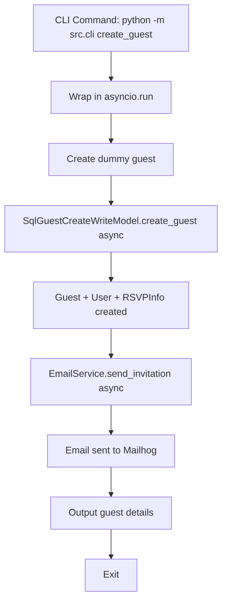

# CLI Command for Creating Dummy Guest and Sending Invitation Email

## Overview

This plan describes how to create a simple Typer-based CLI command that creates one dummy guest and sends an invitation email to Mailhog for frontend testing.

## Architecture



## Implementation Details

### 1. New File: `src/cli/__init__.py`

Create a Typer CLI application with async support:

```python
import asyncio
import typer
from src.guests.features.create_guest.write_model import SqlGuestCreateWriteModel
from src.email.service import email_service

app = typer.Typer(help="CLI commands for wedding RSVP management")

async def _create_guest_and_send_email():
    """Async helper to create guest and send email."""
    # Hardcoded test data
    email = "test@guest.example"
    first_name = "Test"
    last_name = "Guest"
    
    # Create guest
    write_model = SqlGuestCreateWriteModel()
    guest = await write_model.create_guest(
        email=email,
        first_name=first_name,
        last_name=last_name,
    )
    
    # Send invitation email
    await email_service.send_invitation(
        to_address=email,
        guest_name=f"{first_name} {last_name}",
        event_date="August 15, 2026",
        event_location="Castillo de Example, Spain",
        rsvp_url=guest.rsvp.link,
        response_deadline="July 15, 2026",
        couple_names="Alex & Sam",
    )
    
    return guest

@app.command()
def create_guest():
    """Create a dummy guest and send invitation email to Mailhog."""
    # Typer doesn't support async directly, so use asyncio.run
    guest = asyncio.run(_create_guest_and_send_email())
    
    # Output results
    typer.secho(f"Guest created successfully!", fg=typer.colors.GREEN)
    typer.secho(f"Email: test@guest.example", fg=typer.colors.BLUE)
    typer.secho(f"RSVP URL: {guest.rsvp.link}", fg=typer.colors.CYAN)
    typer.secho(f"RSVP Token: {guest.rsvp.token}", fg=typer.colors.CYAN)
    typer.secho(f"Email sent to Mailhog!", fg=typer.colors.GREEN)

if __name__ == "__main__":
    app()
```

### 2. Update `pyproject.toml`

Add Typer to dependencies (no script entry point needed):

```toml
dependencies = [
    # ... existing dependencies
    "typer==0.20.1",
]
```

## Command Usage

```bash
# Create dummy guest and send email
python -m src.cli create_guest

# Or using uv
uv run python -m src.cli create_guest
```

## Expected Output

```
Guest created successfully!
Email: test@guest.example
RSVP URL: http://localhost:4321/rsvp/?token=abc123-def456-...
RSVP Token: abc123-def456-...
Email sent to Mailhog!
```

## Integration with Docker Compose

```bash
# Run inside API container
docker compose exec api python -m src.cli create_guest
```

## Files to Create/Modify

| File | Action |
|------|--------|
| `src/cli/__init__.py` | Create |
| `pyproject.toml` | Modify - add Typer dependency only (no script entry point) |

## Dependencies Required

- `typer==0.20.1` (CLI framework)

## Testing

The command should be tested by:
1. Running `python -m src.cli create_guest`
2. Checking Mailhog UI at http://localhost:8025
3. Verifying the RSVP page loads correctly with the generated token
