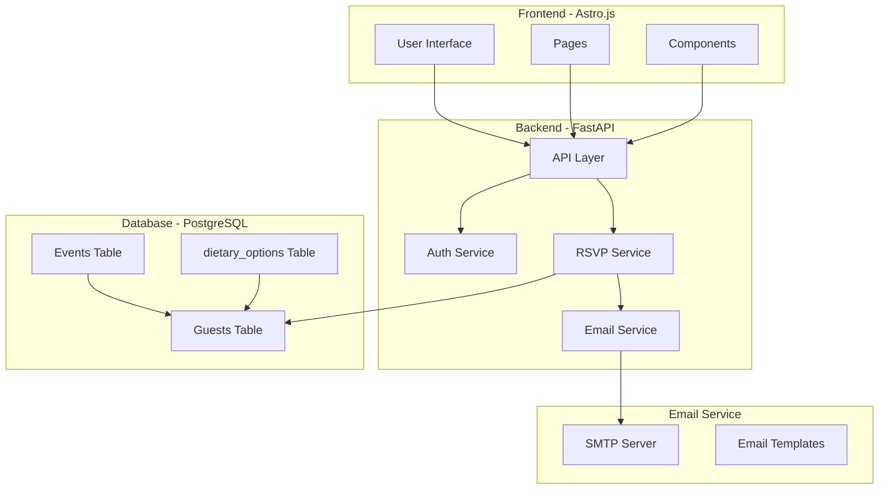
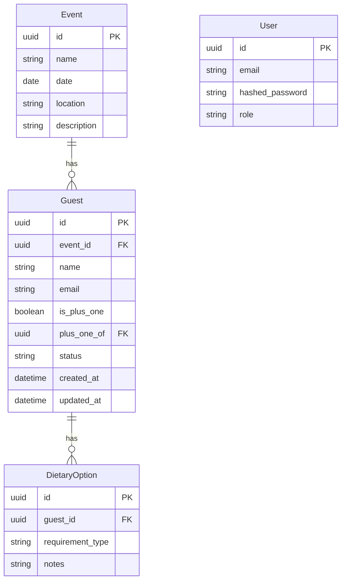
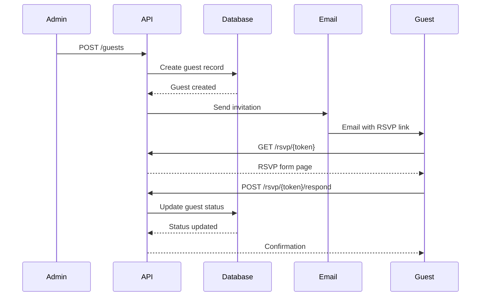
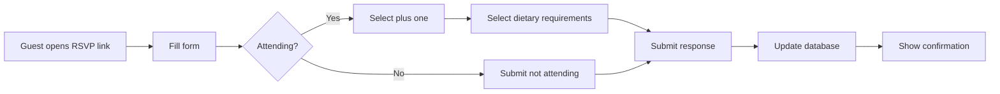

# Wedding Website with RSVP - Implementation Plan

## Overview

This plan outlines the implementation of a wedding website with RSVP functionality using:
- **Backend**: Python with FastAPI
- **Frontend**: Astro.js
- **Database**: PostgreSQL
- **Authentication**: JWT-based authentication
- **Email**: SMTP-based email service

## System Architecture



## Database Schema



## API Endpoints

### Authentication
- `POST /auth/register` - Admin user registration
- `POST /auth/login` - Admin login
- `POST /auth/refresh` - Refresh JWT token

### Guests Management (Admin)
- `GET /guests` - List all guests
- `POST /guests` - Add new guest
- `GET /guests/{id}` - Get guest details
- `PUT /guests/{id}` - Update guest
- `DELETE /guests/{id}` - Delete guest
- `POST /guests/invite` - Send invitation email to guest

### RSVP (Guest)
- `GET /rsvp/{token}` - Get RSVP page with token
- `POST /rsvp/{token}/respond` - Submit RSVP response
  - Body: `{ attending: boolean, plus_one: boolean, dietary_requirements: [...] }`

### Health Check
- `GET /healthz` - Health check endpoint

## Implementation Steps

### Phase 1: Project Setup

#### 1.1 Configuration Files
Create configuration files following PROJECT_STRUCTURE.md:
- `pyproject.toml` - Python project configuration
- `package.json` - Root package.json
- `pnpm-workspace.yaml` - pnpm workspace configuration
- `Dockerfile` - Docker image definition
- `docker-compose.yml` - Docker Compose configuration
- `.envrc` - Environment variables
- `.python-version` - Python version specification

#### 1.2 Backend Configuration
- [`src/config/__init__.py`](src/config/__init__.py) - Config module initialization
- [`src/config/settings.py`](src/config/settings.py) - Application settings
- [`src/config/database.py`](src/config/database.py) - Database configuration
- [`src/config/table_names.py`](src/config/table_names.py) - Table name constants
- [`src/config/logging.py`](src/config/logging.py) - Logging configuration

#### 1.3 Database Models
- [`src/models/__init__.py`](src/models/__init__.py) - Models module initialization
- [`src/models/base.py`](src/models/base.py) - Base model class
- [`src/models/event.py`](src/models/event.py) - Event model
- [`src/models/guest.py`](src/models/guest.py) - Guest model
- [`src/models/dietary.py`](src/models/dietary.py) - Dietary options model
- [`src/models/user.py`](src/models/user.py) - Admin user model

#### 1.4 Email Templates
- [`src/email/__init__.py`](src/email/__init__.py) - Email module initialization
- [`src/email/templates.py`](src/email/templates.py) - Email template definitions
- [`src/email/service.py`](src/email/service.py) - Email sending service

### Phase 2: Backend Implementation

#### 2.1 Main Application
- [`src/main.py`](src/main.py) - FastAPI application entry point

#### 2.2 Core Infrastructure
- [`src/events.py`](src/events.py) - Event definitions
- [`src/conftest.py`](src/conftest.py) - pytest configuration

#### 2.3 Authentication Router
- [`src/routers/auth/__init__.py`](src/routers/auth/__init__.py) - Auth router initialization
- [`src/routers/auth/router.py`](src/routers/auth/router.py) - Auth endpoints
- [`src/routers/auth/schemas.py`](src/routers/auth/schemas.py) - Auth Pydantic schemas
- [`src/routers/auth/service.py`](src/routers/auth/service.py) - Auth business logic

#### 2.4 Health Check Router (already exists in structure)
- [`src/routers/healthz/__init__.py`](src/routers/healthz/__init__.py)
- [`src/routers/healthz/router.py`](src/routers/healthz/router.py)
- [`src/routers/healthz/schema.py`](src/routers/healthz/schema.py)
- [`src/routers/healthz/tests/test_endpoint.py`](src/routers/healthz/tests/test_endpoint.py)

#### 2.5 Guests Router (already exists in structure)
- [`src/routers/guests/__init__.py`](src/routers/guests/__init__.py)
- [`src/routers/guests/router.py`](src/routers/guests/router.py)
- [`src/routers/guests/schemas.py`](src/routers/guests/schemas.py)
- [`src/routers/guests/service.py`](src/routers/guests/service.py)
- [`src/routers/guests/tests/`](src/routers/guests/tests/) - Unit tests

#### 2.6 RSVP Router (already exists in structure)
- [`src/routers/rsvp/__init__.py`](src/routers/rsvp/__init__.py)
- [`src/routers/rsvp/router.py`](src/routers/rsvp/router.py)
- [`src/routers/rsvp/schemas.py`](src/routers/rsvp/schemas.py)
- [`src/routers/rsvp/service.py`](src/routers/rsvp/service.py)

### Phase 3: Database Migrations

#### 3.1 Migration Setup
- [`alembic.ini`](alembic.ini) - Alembic configuration
- [`migrations/env.py`](migrations/env.py) - Migration environment
- [`migrations/script.py.mako`](migrations/script.py.mako) - Migration template

#### 3.2 Create Migrations
- Create initial migration for all models
- Migration for adding default admin user

### Phase 4: Frontend Implementation

#### 4.1 Frontend Setup
- [`frontend/src/pages/`](frontend/src/pages/) - Astro pages
- [`frontend/src/layouts/`](frontend/src/layouts/) - Page layouts
- [`frontend/src/components/`](frontend/src/components/) - Reusable components
- [`frontend/src/styles/`](frontend/src/styles/) - Global styles
- [`frontend/src/lib/`](frontend/src/lib/) - Frontend utilities

#### 4.2 Pages
- `/` - Landing page
- `/admin` - Admin dashboard (protected)
- `/admin/guests` - Guest management
- `/rsvp/{token}` - RSVP form page

#### 4.3 Components
- Navigation
- Footer
- RSVP Form
- Guest List
- Admin Panel
- Dietary Requirements Selector

### Phase 5: Testing

#### 5.1 Backend Tests
- Unit tests for services
- Integration tests for routers
- pytest configuration

#### 5.2 E2E Tests (Playwright)
- [`packages/e2e/`](packages/e2e/) - E2E test suite
- Test RSVP flow
- Test admin operations
- Test email delivery

### Phase 6: Deployment

#### 6.1 Docker Configuration
- `Dockerfile` - Backend Docker image
- `docker-compose.yml` - Full stack deployment
- `commands/entrypoint.sh` - Container entrypoint
- `commands/start_command.sh` - Start script

#### 6.2 CI/CD
- `.gitlab-ci.yml` - GitLab CI/CD pipeline

## Workflow Description

### Guest Invitation Flow



### RSVP Response Flow



## File Structure Summary

```
├── commands/
│   ├── entrypoint.sh
│   ├── openapi.sh
│   ├── start_command.sh
│   ├── start-e2e-ci.sh
│   ├── test-ci.sh
│   └── test.sh
├── docker-compose/
├── migrations/
├── packages/
│   ├── e2e/
│   └── site/
├── src/
│   ├── accounts/
│   ├── config/
│   │   ├── __init__.py
│   │   ├── database.py
│   │   ├── logging.py
│   │   ├── settings.py
│   │   └── table_names.py
│   ├── email/
│   │   ├── __init__.py
│   │   ├── service.py
│   │   └── templates.py
│   ├── models/
│   │   ├── __init__.py
│   │   ├── base.py
│   │   ├── dietary.py
│   │   ├── event.py
│   │   ├── guest.py
│   │   └── user.py
│   ├── routers/
│   │   ├── auth/
│   │   │   ├── __init__.py
│   │   │   ├── router.py
│   │   │   ├── schemas.py
│   │   │   └── service.py
│   │   ├── guests/
│   │   │   ├── __init__.py
│   │   │   ├── router.py
│   │   │   ├── schemas.py
│   │   │   ├── service.py
│   │   │   └── tests/
│   │   ├── healthz/
│   │   │   ├── __init__.py
│   │   │   ├── router.py
│   │   │   ├── schema.py
│   │   │   └── tests/
│   │   │       └── test_endpoint.py
│   │   └── rsvp/
│   │       ├── __init__.py
│   │       ├── router.py
│   │       ├── schemas.py
│   │       └── service.py
│   ├── __init__.py
│   ├── conftest.py
│   ├── events.py
│   └── main.py
├── frontend/
│   └── src/
│       ├── components/
│       ├── layouts/
│       ├── lib/
│       ├── pages/
│       └── styles/
```

## Next Steps

1. **Approve this plan** - Review and confirm the implementation steps
2. **Switch to Code mode** - Begin implementing the backend first
3. **Set up configuration** - Create pyproject.toml, package.json, etc.
4. **Implement models** - Create database models
5. **Implement routers** - Build API endpoints
6. **Implement frontend** - Create Astro.js pages
7. **Test** - Write unit and E2E tests
8. **Deploy** - Set up Docker and CI/CD
